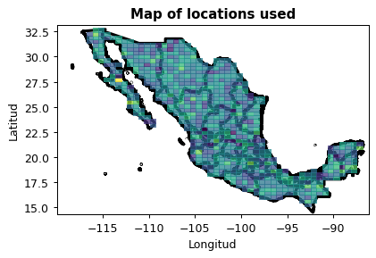
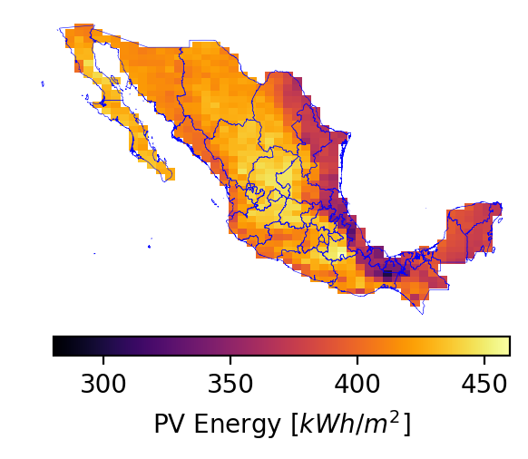
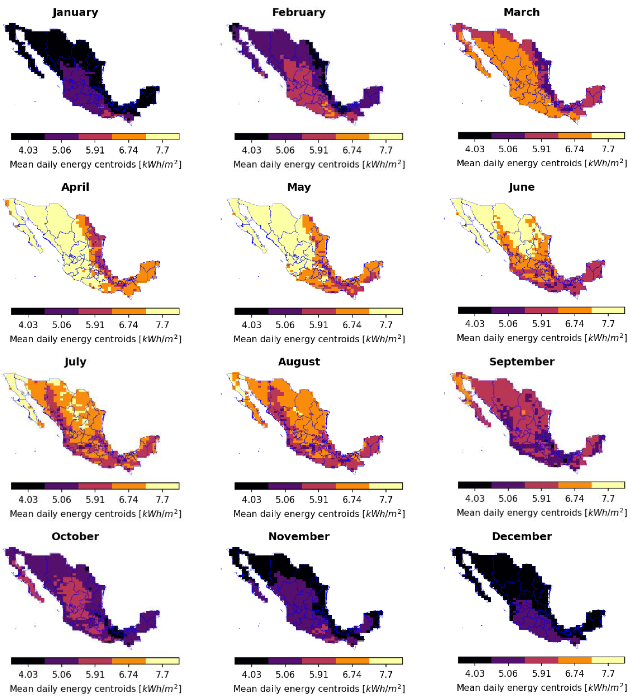

# Photovoltaic Power Generation Forecasting for Regional Assessment using Machine Learning

This is the code for the paper *Photovoltaic Power Generation Forecasting for Regional Assessment using Machine Learning*. <br>
DOI: https://doi.org/10.3390/en15238895  🔗 You can reed the paper here (Open Access)<br>

*This study involves the analysis, collection, and examination of solar radiation data in Mexico, aiming to identify the most suitable locations for harnessing solar resources for electricity generation. The data is classified and divided into regions using the k-means clustering algorithm. This approach allows for the effective grouping of geographical areas based on their comparable average energy availability, facilitating the identification of optimal sites for solar energy utilization.* ☀<br>


**📝 This repository contains the code for raw data download, as well as a notebook that can be used by following the instructions provided in the following sections.**
<br>

Solar energy currently plays a major role in supplying clean and renewable electric energy worldwide. Harnessing solar energy through PV plants requires solving several problems such as site selection, for which solar resource assessment and photovoltaic energy forecasting are fundamental issues. <br> This paper proposes a methodology to solve the long-term version of these two critical requirements based on retrieving solar radiation and temperature data from free access databases and using data clustering and probability techniques. This methodology is demonstrated via a case study for Mexico. Its surface is divided into 731 land cells, for which solar radiation and temperature hourly data are retrieved from NSRDB from 2000 to 2020.

<p style="text-align: center;" align="center">

<h4 align="center"> Each of the pixels correspond to a location used </h4>
</p>

Mean daily solar radiation per month is calculated per cell. Cells are clustered by radiation levels into regions with similar solar resources and mapped monthly. Simultaneously, probabilities of temperature are calculated and mapped per cell. Then, PV energy is calculated per cell including heat losses. As the leading result, PV power forecasting is achieved by constructing the P50 and P90 estimation atlas of mean yearly PV energy for the country. Results show that this methodology can be used to locate potential sites to build PV facilities in a first approximation

<p style="text-align: center;" align="center">

<h4 align="center"> Mean yearly PV energy obtained with the methodology described here </h4>
</p>

<p style="text-align: center;" align="center">
 
<h4 align="center"> The k-means algorithm is employed to cluster regions based on the average energy level they have available at each location </h4>
</p>

## Instalation of requeriments

### Download the data 📲
The data used in the paper can be found on

http://adrianrg.me/drive/paper2022PV/data.h5

Once downloaded it needed to be place on <br>Photovoltaic-Energy-Mexico/Data/data.h5 <br>

For more information how this data was collected please go to the next section.

### Install the dependencies
When using anaconda or miniconda environments use the following command to install all the dependencies

```
conda env create --file=environment.yml

```

This will create an environment called "SRC" with the dependencies described in the  "environment.yml" file.
To star to using this repository we need to activate our new environment with 

```
canda activate SRC
```

## Collection of the data 📊
The collection of the data present in data.h5 start when downloading directly from  the NSRDB webpage (https://nsrdb.nrel.gov/data-viewer/download/big-data). <br> Once define the datapoints of our study we need to download the data for each of the points. This can take a while due to the limitations of the NSRDB webpage and the amount of data downloaded (>10 GB). The python functions for download data from the NSRDB are implemented in modulos/nsrdb.py

Note: Each of the files coming  from the NSRDB are on csv format and contain the data of one year of one point.

Once downloaded we concatenate the data of all the years downloaded into one table, we only take the GHI and Temperature columns and change the type of variables to float16 to save disk space.

Then we save this table on the hdf5 file (data.h5) with  the label being the coordinates of the point.

The access of the information in the code is done by the python module placed in: <br>
Photovoltaic-Energy-Mexico/lib/datos.py

The steps described here reduce the raw data (10GB) to a hdf5 file of only 300MB that is faster and easier to use. 

## Acknowledgments
This work arises from the project “Predicción del Recurso Solar usando imágenes satelitales para impulsar el desarrollo sostenible en comunidades aisladas con energía asequible y no contaminante” approved in the Proyecto Espacial Universitario (PEU) from Universidad Nacional Autónoma de México (UNAM). The authors thank the PEU program for their support in the publication of this work. Monica Borunda also thanks CONACYT for her Catedra Research Position with ID 71557, and to CENIDET for its hospitality
